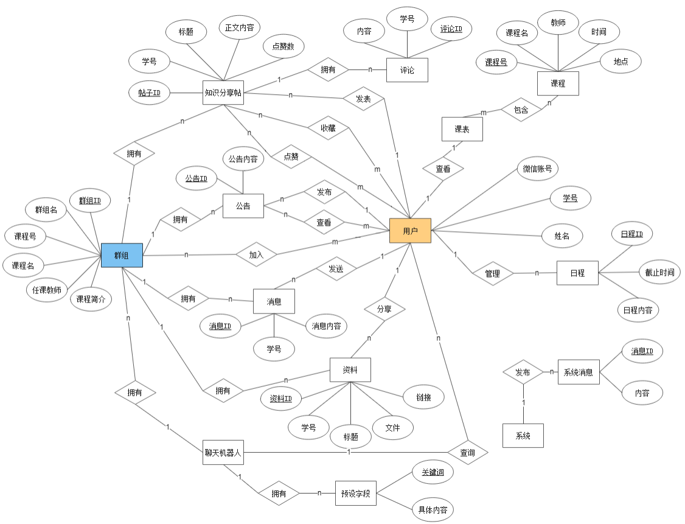

# 趣学

一款面向北航本科的群组学习软件

 点击这里通往用户端：https://github.com/RedRevolution/LearnForFun-WeChatApp




数据库设计

```mysql
drop database learnforfun;
create database learnforfun;
use learnforfun;
```

用户

```mysql
create table tbl_user_info(
    id bigint(20) NOT NULL AUTO_INCREMENT COMMENT '主键',
    open_id varchar(32) NOT NULL COMMENT '微信授权的用户唯一ID',
    user_id varchar(16) NOT NULL COMMENT '学号/工号',
    user_name varchar(16) NOT NULL COMMENT '姓名',
    primary key(id)
)ENGINE=InnoDB AUTO_INCREMENT=1 DEFAULT CHARSET=utf8;
# 用户登录操作较为频繁
ALTER TABLE tbl_user_info ADD UNIQUE INDEX idx (open_id);
```

日程

> 删除某条日程记录的时候根据自增主键id去删除
>
> 截止时间格式： 20200519192936
>
> 定期删除记录：根据系统时间和deadline字段判断

```mysql
create table tbl_user_timetable(
    id bigint(20) NOT NULL AUTO_INCREMENT,
    user_id varchar(16) NOT NULL COMMENT '学号/工号',
	content varchar(256) NOT NULL COMMENT '日程内容',
    deadline varchar(16) NOT NULL COMMENT '截止时间',
    primary key(id)
)ENGINE=InnoDB AUTO_INCREMENT=1 DEFAULT CHARSET=utf8;
# 查看日程的操作较为频繁
ALTER TABLE tbl_user_timetable ADD INDEX idx (user_id);
```

课程

> 授课老师：xxx，xxx，...   
>
> 上课时间地点格式：(周数/星期/节数/地点)(...)(...)
>
> 如: (2-7/日/3,4/沙河J502)(...) 用括号进行分组
>

```mysql
create table tbl_course_info(
	id bigint(20) NOT NULL AUTO_INCREMENT,
    course_id varchar(64) NOT NULL COMMENT '课程ID',
    course_code varchar(16) NOT NULL COMMENT '课程代码',
    course_name varchar(32) NOT NULL COMMENT '课程名',
    teacher_name varchar(32) NOT NULL COMMENT '授课教师',
    class_info varchar(128) NOT NULL COMMENT '上课时间及地点',
    group_id varchar(32) NOT NULL COMMENT '官方群组ID',
    primary key(id)
)ENGINE=InnoDB AUTO_INCREMENT=1 DEFAULT CHARSET=utf8;
# 经常查询课程的信息                            
ALTER TABLE tbl_course_info ADD INDEX idx (course_id);
```

选课情况

```mysql
create table tbl_select_course(
	id bigint(20) NOT NULL AUTO_INCREMENT,
    student_id varchar(16) NOT NULL COMMENT '学号',
    course_id varchar(64) NOT NULL COMMENT '课程ID',
    primary key(id)
)ENGINE=InnoDB AUTO_INCREMENT=1 DEFAULT CHARSET=utf8;
# 经常查询学生的选课情况
ALTER TABLE tbl_select_course ADD INDEX idx (student_id);
```

系统/反馈

> 消息源：00000000，表示该消息是系统消息，由后台发布，所有用户可见
>
> 消息源：其他，表示该消息是用户的反馈意见或请求，由用户发布，管理后台可见
>
> 定期删除记录：create_by字段判断

```mysql
create table sys_message(
	id bigint(20) NOT NULL AUTO_INCREMENT,
    user_id varchar(16) NOT NULL COMMENT '消息源',
    content varchar(256) NOT NULL COMMENT '消息内容',
    create_by datetime NOT NULL DEFAULT CURRENT_TIMESTAMP COMMENT '创建时间',
    primary key(id)
)ENGINE=InnoDB AUTO_INCREMENT=1 DEFAULT CHARSET=utf8;
ALTER TABLE sys_message ADD INDEX idx (user_id);
```

群组

> 群组ID在创建群组时生成，格式：Q20200502134117373291	[QI]创建时间创建人ID
>
> 官方群组由后台创建，用户创建的群组都是个人群组

```mysql
create table tbl_group_info(
    id bigint(20) NOT NULL AUTO_INCREMENT,
	group_id varchar(32) NOT NULL COMMENT '群组ID',
	group_name varchar(32) NOT NULL COMMENT '群组名',
    group_owner_id varchar(16) NOT NULL COMMENT '创建人ID',
    group_owner_name varchar(16) NOT NULL COMMENT '创建人姓名',
	group_introd varchar(256) NOT NULL DEFAULT '' COMMENT '群组介绍',
    course_code varchar(16) NOT NULL COMMENT '课程代码',
	primary key(id)
)ENGINE=InnoDB AUTO_INCREMENT=1 DEFAULT CHARSET=utf8;
# 经常查询群组的情况
ALTER TABLE tbl_group_info ADD INDEX idx (group_id);
```

用户群组关系表

```mysql
create table tbl_user_group(
    id bigint(20) NOT NULL AUTO_INCREMENT,
    user_id varchar(16) NOT NULL COMMENT '学号/工号',
    user_name varchar(16) NOT NULL COMMENT '名字',
    group_id varchar(32) NOT NULL COMMENT '群组ID',
    is_administrator tinyint(1) NOT NULL DEFAULT '0' COMMENT '1为管理员,0为成员',
    primary key(id)
)ENGINE=InnoDB AUTO_INCREMENT=1 DEFAULT CHARSET=utf8;
# 经常查询用户加入了哪些群组
ALTER TABLE tbl_user_group ADD INDEX idx (user_id);
```

分享

> 分享ID：K20200502134117373291  类型[KR]分享时间分享人ID
>
> 可按点赞数排序

```mysql
create table tbl_group_share(
	id bigint(20) NOT NULL AUTO_INCREMENT,
    share_id varchar(32) NOT NULL COMMENT '分享ID',
	group_id varchar(32) NOT NULL COMMENT '群组ID',
    group_name varchar(16) NOT NULL COMMENT '群组名',
    user_id varchar(16) NOT NULL COMMENT '分享人ID',
    user_name varchar(16) NOT NULL COMMENT '分享人姓名',
	topic varchar(64) NOT NULL COMMENT '主题',
    likes_num int(4) NOT NULL DEFAULT '0' COMMENT '点赞数',
    comment_num int(4) NOT NULL DEFAULT '0' COMMENT '评论数',
	content varchar(5000) NOT NULL COMMENT '知识内容/资源链接',
	primary key(id)
)ENGINE=InnoDB AUTO_INCREMENT=1 DEFAULT CHARSET=utf8;
# 经常查看分享内容
ALTER TABLE tbl_group_share ADD INDEX idx (share_id);
```

收藏列表

```mysql
create table tbl_user_collect(
	id bigint(20) NOT NULL AUTO_INCREMENT,
    user_id varchar(16) NOT NULL COMMENT '学号/工号',
    share_id varchar(32) NOT NULL COMMENT '分享ID',
	primary key(id)
)ENGINE=InnoDB AUTO_INCREMENT=1 DEFAULT CHARSET=utf8;
# 经常自己的收藏列表
ALTER TABLE tbl_user_collect ADD INDEX idx (user_id);
```

评论列表

```mysql
create table tbl_share_comment(
    id bigint(20) NOT NULL AUTO_INCREMENT,
    share_id varchar(32) NOT NULL COMMENT '分享ID',
    user_id varchar(16) NOT NULL COMMENT '评论人ID',
    user_name varchar(16) NOT NULL COMMENT '评论人姓名',
    content varchar(256) NOT NULL COMMENT '评论内容',
	primary key(id)
)ENGINE=InnoDB AUTO_INCREMENT=1 DEFAULT CHARSET=utf8;
ALTER TABLE tbl_share_comment ADD INDEX idx (share_id);
```

群组消息

> 根据消息时间定期清理

```mysql
create table tbl_group_message(
    id bigint(20) NOT NULL AUTO_INCREMENT,
    group_id varchar(32) NOT NULL COMMENT '群组ID',
	user_id varchar(16) NOT NULL COMMENT '发言人学号/工号',
    user_name varchar(16) NOT NULL COMMENT '发言人姓名',
	content varchar(256) NOT NULL COMMENT '发言内容',
	create_by datetime DEFAULT CURRENT_TIMESTAMP NOT NULL COMMENT '发言时间',
    primary key(id)
)ENGINE=InnoDB AUTO_INCREMENT=1 DEFAULT CHARSET=utf8;
ALTER TABLE tbl_group_message ADD INDEX idx (group_id);
```

群组公告

```mysql
create table tbl_group_notice(
    id bigint(20) NOT NULL AUTO_INCREMENT,
	group_id varchar(32) NOT NULL COMMENT '群组ID',
	user_id varchar(16) NOT NULL COMMENT '发布公告者学号/工号',
    user_name varchar(16) NOT NULL COMMENT '发布公告者姓名',
	content varchar(256) NOT NULL COMMENT '公告内容',
    create_by datetime DEFAULT CURRENT_TIMESTAMP NOT NULL COMMENT '发布时间',
	primary key(id)
)ENGINE=InnoDB AUTO_INCREMENT=1 DEFAULT CHARSET=utf8;
ALTER TABLE tbl_group_notice ADD INDEX idx (group_id);
```

预设字段

```mysql
create table sys_chatbot(
    id bigint(20) NOT NULL AUTO_INCREMENT,
	ask varchar(256) NOT NULL COMMENT '用户输入的问题',
    answer varchar(256) NOT NULL COMMENT '针对用户输入的回答',
	primary key(id)
)ENGINE=InnoDB AUTO_INCREMENT=1 DEFAULT CHARSET=utf8;
```

